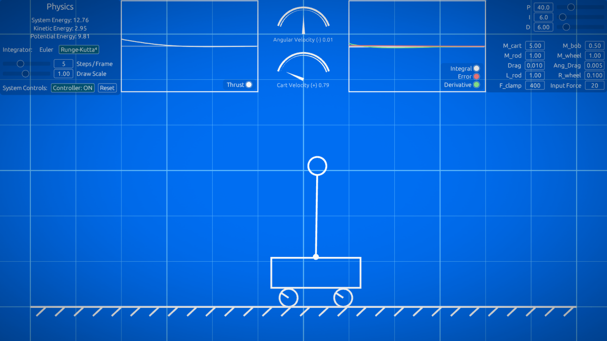
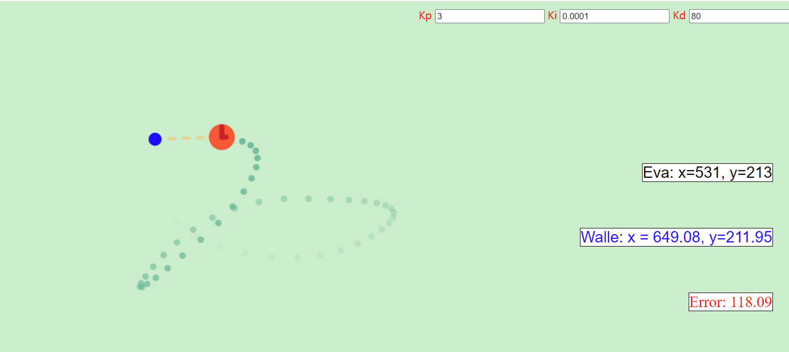
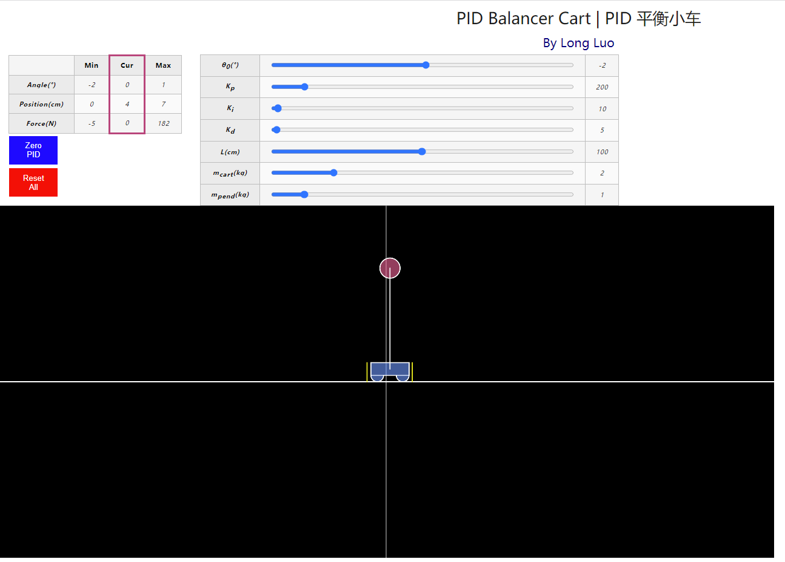

# PID Controller

Read more about [PID Controller](http://www.longluo.me/blog/2023/05/05/pid/)

**Download** the [PID-cart.exe](https://github.com/longluo/Publish/blob/master/PID/PID-cart.exe) and executing, use LEFT or RIGHT key to make the pendulum to **Swing**.

If you don't want to download the exe file, you can try it on the web.

The Simple [Online Interactive PID Controller](http://www.longluo.me/projects/pid/):

The [PID Controller Cart](http://www.longluo.me/projects/pidcart/) :

